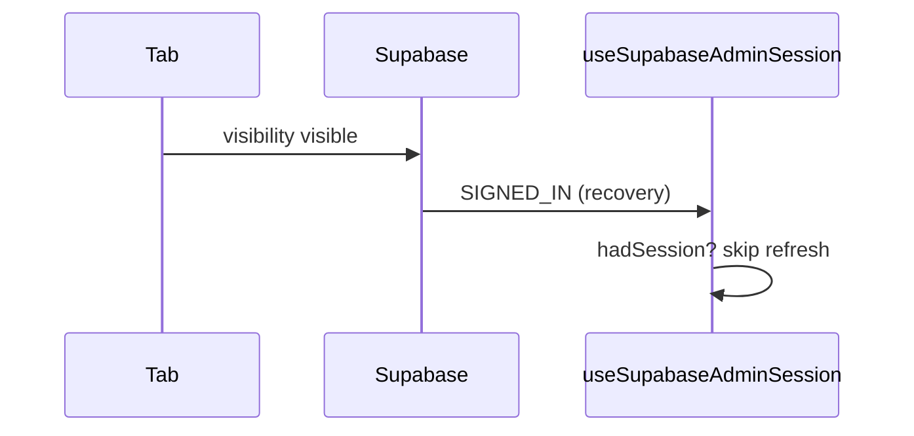

# Journal d'apprentissage

Mémoire pédagogique ciblée. Chaque entrée = **tags + pratique nommée + concept + pourquoi + option rejetée** (+ diagramme si utile).

Vocabulaire des tags : [`domains.md`](./domains.md).

Format :

```md
### YYYY-MM-DD - Sujet
**Tags :** `state` `visibility`
**Bonne pratique :** single source of truth ; explicit empty/error states
**Concept :** ...
**Pourquoi :** ...
**Pas choisi :** ...
**À retenir :** (une phrase)

```mermaid
%% optionnel — seulement si ça clarifie
```
```

---

<!-- Les entrées commencent ci-dessous -->

### 2026-08-12 - Admin refresh au retour d'onglet
**Tags :** `effects` `state` `visibility`
**Bonne pratique :** distinguish side-effect triggers ; stable dependency keys ; soft background refetch
**Concept :** Supabase émet `SIGNED_IN` lors du `_recoverAndRefresh` au `visibilitychange` — ce n'est pas un vrai login.
**Pourquoi :** hook `useSupabaseAdminSession` ignore recovery si session déjà présente ; `CoursesAdmin` dépend de `userId` pas de l'objet `session` ; refresh vocab en `soft`.
**Pas choisi :** `autoRefreshToken: false` (casserait le refresh token) ; React Query `refetchOnWindowFocus: false` (pas dans le stack).
**À retenir :** ne jamais brancher un reload complet sur `SIGNED_IN` sans vérifier si l'utilisateur était déjà connecté.



### 2026-08-12 - Structure racine + traductions configurables
**Tags :** `data-modeling` `ux` `solid`
**Bonne pratique :** single source of truth ; Open/Closed (catalogue + flags translate)
**Concept :** `itemStructure` sur catégorie racine (`langs` + `fields[{id,type,translate}]`) ; enfants héritent ; EN requis ; colonnes optionnelles ; listes i18n si translate.
**Pourquoi :** thème ≠ profil figé ; antonymes peuvent avoir FR/MG ; UI table desktop / cartes mobile.
**Pas choisi :** profils adjective/phrasal ; tabs comme axe principal.
**À retenir :** configurer la structure sur la racine, pas sur chaque mot ni sous-catégorie.

### 2026-08-12 - Colonnes : rename / add / delete
**Tags :** `data-modeling` `ux`
**Bonne pratique :** Open/Closed ; label override (presentation ≠ id)
**Concept :** `fields[].label` pour renommer ; presets + colonnes custom (`id` validé) ; suppression / reorder dans l’éditeur racine ; `attrs` persist toutes les clés hors colonnes core.
**Pourquoi :** le catalogue fixe ne suffit pas (nuance, registre métier…) sans perdre les presets.
**Pas choisi :** renommer l’`id` après coup (casse les données) ; UI table-only pour config.
**À retenir :** l’`id` est la clé stable ; le libellé est de la présentation.

### 2026-08-12 - Libellé colonne : draft local
**Tags :** `ux` `state`
**Bonne pratique :** controlled draft + commit on blur (pas autosave keystroke)
**À retenir :** ne pas brancher `onChange` input → persist serveur quand on édite du texte libre.

### 2026-08-12 - VocabCard compact EN-first
**Tags :** `ux` `visibility`
**Bonne pratique :** primary language as hierarchy anchor ; subtle color coding
**Concept :** titre toujours EN (lecture) + IPA visible ; FR/MG en lignes ; bordure catégorie + chips teintés légers.
**Pourquoi :** lexique anglais-first, densifier sans perdre la lisibilité (titre ~18–19px, traductions 15px).
**Pas choisi :** titre = langue UI ; palette saturée type dashboard.
**À retenir :** EN = titre, le reste = support ; couleur = signal, pas décor.
