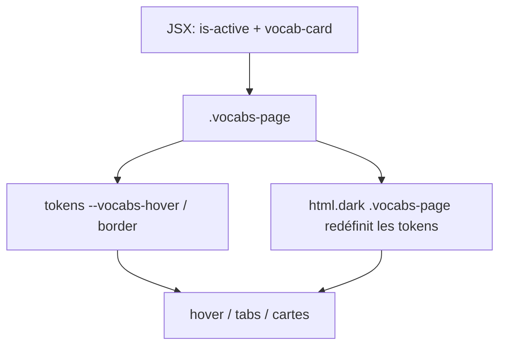
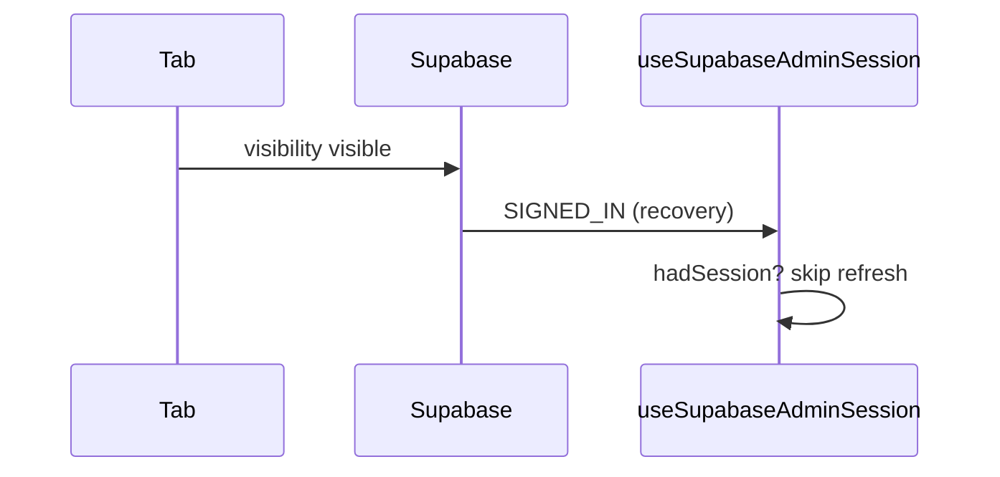
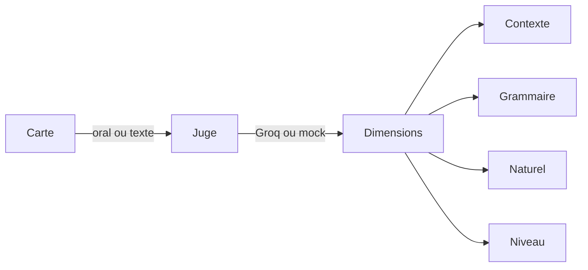
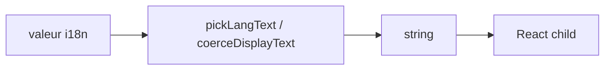
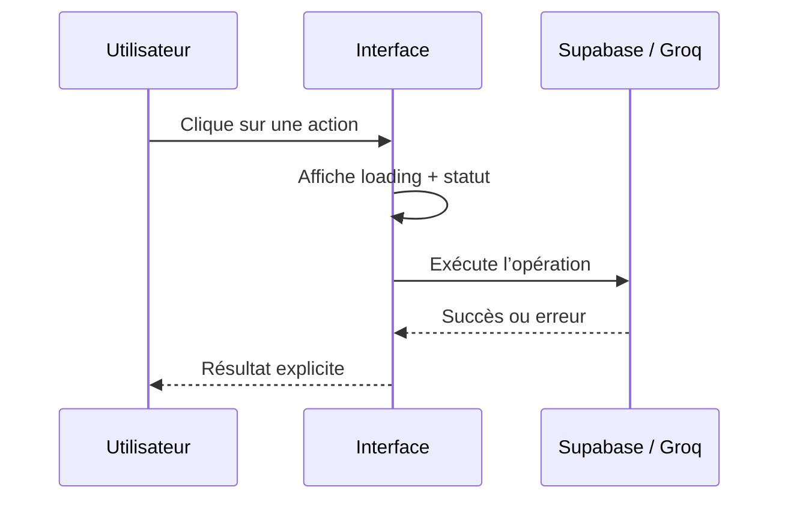

# Journal d'apprentissage

Mémoire pédagogique ciblée. Chaque entrée = **tags + pratique nommée + concept + pourquoi + option rejetée** (+ diagramme si utile).

Vocabulaire des tags : [`domains.md`](./domains.md).

Format :

```md
### YYYY-MM-DD - Sujet
**Tags :** `state` `visibility`
**Bonne pratique :** single source of truth ; explicit empty/error states
**Concept :** ...
**Pourquoi :** ...
**Pas choisi :** ...
**À retenir :** (une phrase)

```mermaid
%% optionnel — seulement si ça clarifie
```
```

---

<!-- Les entrées commencent ci-dessous -->

### 2026-08-18 - MediVocabs CSS : états sémantiques + dark hover
**Tags :** `ux` `visibility` `naming`
**Bonne pratique :** semantic class over utility coupling ; prefers-reduced-motion
**Concept :** le refresh visuel overlay CSS reste, mais les états (tab/catégorie active) passent par `is-active` plutôt que par une classe Tailwind hex. Le hover catégories utilise `:not(.is-active)` + tokens `--vocabs-hover` redéfinis sous `html.dark .vocabs-page`.
**Pourquoi :** `background: #f5f8ff !important` sans dark flashait en clair ; `flex-wrap` tuait le scroll horizontal des tabs ; les contrôles Révision n’avaient pas de cellule grid.
**Pas choisi :** refactorer tout le JSX en tokens `--lh-*` (trop large) ; cibler `.bg-[#1a73e8]` (casse dès qu’on change la couleur).
**À retenir :** un overlay CSS ne doit pas sélectionner une utility Tailwind ; il doit sélectionner un état nommé, scoped au layout.




### 2026-08-12 - Admin refresh au retour d'onglet
**Tags :** `effects` `state` `visibility`
**Bonne pratique :** distinguish side-effect triggers ; stable dependency keys ; soft background refetch
**Concept :** Supabase émet `SIGNED_IN` lors du `_recoverAndRefresh` au `visibilitychange` — ce n'est pas un vrai login.
**Pourquoi :** hook `useSupabaseAdminSession` ignore recovery si session déjà présente ; `CoursesAdmin` dépend de `userId` pas de l'objet `session` ; refresh vocab en `soft`.
**Pas choisi :** `autoRefreshToken: false` (casserait le refresh token) ; React Query `refetchOnWindowFocus: false` (pas dans le stack).
**À retenir :** ne jamais brancher un reload complet sur `SIGNED_IN` sans vérifier si l'utilisateur était déjà connecté.



### 2026-08-12 - Structure racine + traductions configurables
**Tags :** `data-modeling` `ux` `solid`
**Bonne pratique :** single source of truth ; Open/Closed (catalogue + flags translate)
**Concept :** `itemStructure` sur catégorie racine (`langs` + `fields[{id,type,translate}]`) ; enfants héritent ; EN requis ; colonnes optionnelles ; listes i18n si translate.
**Pourquoi :** thème ≠ profil figé ; antonymes peuvent avoir FR/MG ; UI table desktop / cartes mobile.
**Pas choisi :** profils adjective/phrasal ; tabs comme axe principal.
**À retenir :** configurer la structure sur la racine, pas sur chaque mot ni sous-catégorie.

### 2026-08-12 - Colonnes : rename / add / delete
**Tags :** `data-modeling` `ux`
**Bonne pratique :** Open/Closed ; label override (presentation ≠ id)
**Concept :** `fields[].label` pour renommer ; presets + colonnes custom (`id` validé) ; suppression / reorder dans l’éditeur racine ; `attrs` persist toutes les clés hors colonnes core.
**Pourquoi :** le catalogue fixe ne suffit pas (nuance, registre métier…) sans perdre les presets.
**Pas choisi :** renommer l’`id` après coup (casse les données) ; UI table-only pour config.
**À retenir :** l’`id` est la clé stable ; le libellé est de la présentation.

### 2026-08-12 - Libellé colonne : draft local
**Tags :** `ux` `state`
**Bonne pratique :** controlled draft + commit on blur (pas autosave keystroke)
**À retenir :** ne pas brancher `onChange` input → persist serveur quand on édite du texte libre.

### 2026-08-12 - VocabCard compact EN-first
**Tags :** `ux` `visibility`
**Bonne pratique :** primary language as hierarchy anchor ; subtle color coding
**Concept :** titre toujours EN (lecture) + IPA visible ; FR/MG en lignes ; bordure catégorie + chips teintés légers.
**Pourquoi :** lexique anglais-first, densifier sans perdre la lisibilité (titre ~18–19px, traductions 15px).
**Pas choisi :** titre = langue UI ; palette saturée type dashboard.
**À retenir :** EN = titre, le reste = support ; couleur = signal, pas décor.

### 2026-08-12 - category vide + IPA string + pratique carte
**Tags :** `data-modeling` `ux` `learning`
**Bonne pratique :** coerce at boundaries ; practice affordance on each item
**Concept :** tag `category` (Organe…) vidé / masqué ; `phonetic` toujours chaîne via `coercePhoneticString` ; pratique Oral+Texte sur chaque carte EN.
**Pourquoi :** confondre type MediVocabs et thème arbre ; `String({})` → `[object Object]` à l’import.
**Pas choisi :** garder badge Organe ; pratique réservée aux expressions.
**À retenir :** phonetic objet `{en}` → coerce EN à l’import/form ; practice = mic sur toute carte EN.

### 2026-08-12 - phonetic i18n object import
**Tags :** `data-modeling` `visibility`
**Bonne pratique :** coerce at boundaries
**Concept :** import `{ phonetic: { en, fr, mg } }` accepté → colonne IPA = `en` ; form structure ne réassigne plus l’objet brut (évite `[object Object]` dans l’input).
**Pourquoi :** les exports humains sont souvent i18n ; `String(obj)` / `value={obj}` cassent l’UI.
**Pas choisi :** stocker phonetic multilingue en attrs.
**À retenir :** frontières lecture/écriture = toujours `coercePhoneticString`.

### 2026-08-12 - Simulation domain-aware
**Tags :** `architecture` `learning` `ux`
**Bonne pratique :** domain-aware defaults, not domain-hardcoded core
**Concept :** `scenarioProfiles` — médical (doctor/patient) pour `medi-vocabs`, général (learner/partner) ailleurs ; presets + prompts LLM + UI copy suivent le profil.
**Pourquoi :** adjectifs / tech ne doivent pas forcer une visite clinique.
**Pas choisi :** masquer Simulation hors MediVocabs ; un seul pack médical pour tous.
**À retenir :** le moteur est générique ; le médical est un profil.

### 2026-08-12 - Simulation UI modernisée
**Tags :** `ux` `visibility`
**Bonne pratique :** shared design system for a surface ; chat bubbles for dialogue
**À retenir :** chrome pratique partagé (`practiceUi`) + bulles alignées par rôle + accent teal/sky.

### 2026-08-12 - coerceDisplayText + colonnes wrap + rôles A/B
**Tags :** `visibility` `ux` `data-modeling`
**Bonne pratique :** coerce at boundaries ; density by content role ; domain-aware defaults
**Concept :** extraire une chaîne depuis i18n imbriqué (jamais `String(obj)`) ; champs structure courts en flex-wrap centré ; simulation vocabulaire = interlocuteurs A/B, médical seulement si preset clinique.
**Pourquoi :** `[object Object]` fuyait encore via `normalizeI18nValue` ; syn/ant empilés gaspillaient la largeur ; `medi-vocabs` forçait doctor/patient sur tout le vocab.
**Pas choisi :** patch render-only ; CSS grid `1fr` ; supprimer le profil médical.
**À retenir :** frontières = texte affichable ; colonnes courtes partagent une rangée ; A/B est le défaut, le cabinet est un preset.

### 2026-08-13 - Vercel fail : unused `canStart`
**Tags :** `tooling` `error-handling`
**Bonne pratique :** fail loudly in CI ; no dead assignments
**Concept :** Create React App traite les warnings ESLint comme des erreurs dès que `CI=true` (Vercel le pose tout seul).
**Pourquoi :** `canStart` existait encore après le refactor UI mais n’était plus passé à `disabled` — le bouton Simulation écrit, lui, le branche encore.
**Pas choisi :** désactiver ESLint / `CI=false` sur Vercel (ça masquerait les prochaines fuites).
**À retenir :** un unused var suffit à faire rater le deploy prod ; vérifier avec `CI=true npm run build`.

### 2026-08-13 - Pratique carte : phrase en contexte
**Tags :** `ux` `learning` `api-design`
**Bonne pratique :** Single Responsibility ; ports & adapters ; fail safely in prod
**Concept :** produce-and-assess — l’apprenant invente une phrase avec le mot (ou syn/ant) ; le score pondère le **contexte** (45 %), puis grammaire, naturel, niveau. L’exemple n’est pas obligatoire.
**Pourquoi :** `scorePronunciation` comparait au titre et pénalisait les mots en trop — exactement l’inverse d’une production libre.
**Pas choisi :** réutiliser `written-turn` (c’est un dialogue) ; heuristique seule (ne détecte pas le mauvais sens d’un homographe).
**À retenir :** le drill « répéter la réplique » reste sur les exemples ; la carte vocab juge une phrase.



### 2026-08-13 - React #31 : objet i18n en enfant
**Tags :** `error-handling` `visibility` `data-modeling`
**Bonne pratique :** coerce at boundaries
**Concept :** React refuse `{en, fr, mg}` comme child. `pickLangText` + `coerceDisplayText` extraient une string (y compris i18n imbriqué) avant le JSX — mode Image, labels, scénarios, admin.
**Pourquoi :** `VocabCard` était déjà protégé ; `VocabsView` image grid et `getLabel` (`obj[lang] \|\| obj.fr`) laissaient fuir l’objet.
**Pas choisi :** ErrorBoundary seul (ça masque) ; `String(obj)` (`[object Object]`).
**À retenir :** un champ « texte » qui vaut `{en,fr,mg}` doit passer par un picker, jamais `{item.en}` brut.

Le crash restant (clés `{fr, en, mg}` dans un `<p>`) venait de `PracticeSimulation` : `domain.meta.title` interpolé tel quel à côté d’un `<span>`. Même piège : `obj[lang] || obj.fr` si `fr` est encore un objet.


### 2026-08-20 - Partage mobile, suppression observable et explication contextuelle
**Tags :** `visibility` `state` `async`
**Bonne pratique :** single source of truth ; explicit loading/error states ; fail safely in prod
**Concept :** le menu de partage mobile doit être visible hors du conteneur du bandeau, tandis que les opérations longues doivent exposer un état unique de chargement avec une durée écoulée. Le bouton d’explication réutilise l’adaptateur RAG existant au lieu de créer un second chemin Groq.
**Pourquoi :** le problème de clic venait aussi du `overflow: hidden` du bandeau ; un simple `z-index` n’aurait pas suffi. Le provider de suppression n’offre pas de progression par fichier, donc le temps écoulé est le signal honnête disponible. La clé Groq reste côté Edge Function.
**Pas choisi :** un portail React pour le menu ; une nouvelle API de progression ; un appel Groq direct depuis le navigateur.
**À retenir :** rendre visibles les états réels de l’async améliore la confiance sans inventer une progression que le backend ne mesure pas.


