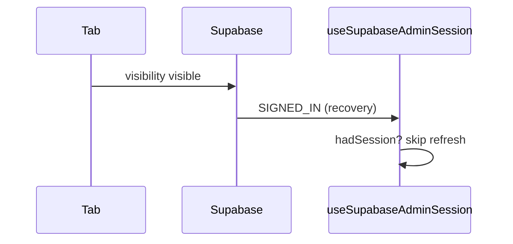

# Journal d'apprentissage

Mémoire pédagogique ciblée. Chaque entrée = **tags + pratique nommée + concept + pourquoi + option rejetée** (+ diagramme si utile).

Vocabulaire des tags : [`domains.md`](./domains.md).

Format :

```md
### YYYY-MM-DD - Sujet
**Tags :** `state` `visibility`
**Bonne pratique :** single source of truth ; explicit empty/error states
**Concept :** ...
**Pourquoi :** ...
**Pas choisi :** ...
**À retenir :** (une phrase)

```mermaid
%% optionnel — seulement si ça clarifie
```
```

---

<!-- Les entrées commencent ci-dessous -->

### 2026-08-12 - Admin refresh au retour d'onglet
**Tags :** `effects` `state` `visibility`
**Bonne pratique :** distinguish side-effect triggers ; stable dependency keys ; soft background refetch
**Concept :** Supabase émet `SIGNED_IN` lors du `_recoverAndRefresh` au `visibilitychange` — ce n'est pas un vrai login.
**Pourquoi :** hook `useSupabaseAdminSession` ignore recovery si session déjà présente ; `CoursesAdmin` dépend de `userId` pas de l'objet `session` ; refresh vocab en `soft`.
**Pas choisi :** `autoRefreshToken: false` (casserait le refresh token) ; React Query `refetchOnWindowFocus: false` (pas dans le stack).
**À retenir :** ne jamais brancher un reload complet sur `SIGNED_IN` sans vérifier si l'utilisateur était déjà connecté.



### 2026-08-12 - Vocab profils flexibles + traductions optionnelles
**Tags :** `data-modeling` `ux` `solid`
**Bonne pratique :** Open/Closed ; single source of truth ; progressive disclosure
**Concept :** catalogue de champs + `itemProfile` par catégorie ; fiche verticale ; langues optionnelles (label seulement si rempli).
**Pourquoi :** adjectifs ≠ phrasal verbs ≠ collocations sans tabs MediVocabs ni table scroll-X.
**Pas choisi :** schéma unique figé ; JSON `extra` libre ; tableau Excel mobile.
**À retenir :** données tabulaires, UI empilée ; profil sur le thème, pas sur chaque mot.
