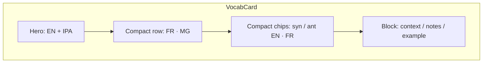

# Plan : VocabCard — layout compact (mots courts côte à côte)

**Date :** 2026-08-12  
**Complexité :** petite  
**Tags :** `ux` `visibility` `kiss`

## Problème (une phrase)

Sur une carte, le mot principal et les exemples longs méritent de l’espace vertical ; les autres contenus (traductions, syn/ant, particle…) sont courts et devraient s’aligner côte à côte sans perdre la lisibilité.

## Ce que j'ai compris de l'existant (EXPLORE)

- Fichiers : `VocabCard.jsx`, `RevealableLangRow.jsx` / `LangRow`, structure fields via `itemStructure`.
- Aujourd’hui : titre EN + IPA ; traductions FR/MG en **lignes empilées** ; listes (syn/ant) en chips avec EN au-dessus et trad **sous** le chip (`flex-col`).
- Les « longs » typiques : `context`, `notes`, `example` / dialogue — phrases.
- Les « courts » typiques : traductions de tête (FR/MG), `synonyms`, `antonyms`, `particle`, `pattern`, `register`.
- IPA `[object Object]` : bug import objet i18n (fix déjà en cours) — hors scope layout, mais à re-importer.

## Comment savoir « court » vs « long » ?

Trois façons réalistes :

### Option A — **Règle par rôle de champ** (catalogue / ids connus) — recommandée

Déclarer dans le code (près du catalogue ou dans `VocabCard`) :

| Rôle | Exemples | Layout |
|------|----------|--------|
| Hero | `en` (titre) | toujours seul, gros |
| Compact | traductions FR/MG, `synonyms`, `antonyms`, `particle`, `pattern`, `register` | inline / côte à côte |
| Block | `context`, `notes`, `example`, `dialogue` | pleine largeur, empilé |

Champs custom inconnus : **compact par défaut** si `type === 'list'` ou texte court ; **block** si `type === 'text' && translate` (souvent une phrase) *ou* si longueur runtime > seuil (filet de sécurité).

- **Pour :** prévisible, KISS, aligné avec le modèle mental « colonne structure ».
- **Contre :** un custom « définition longue » mal classé → filet longueur corrige.

### Option B — **Uniquement longueur runtime**

Si `text.length > N` (ex. 48) → block, sinon compact.

- **Pour :** zéro config, marche pour customs.
- **Contre :** un synonyme long bascule en block de façon capricieuse ; seuil arbitraire ; flash de layout si édition.

### Option C — **Flag `layout: 'compact' | 'block'` dans `itemStructure`**

L’admin choisit par colonne.

- **Pour :** contrôle total.
- **Contre :** YAGNI pour l’instant ; surcharge UI structure ; on peut l’ajouter plus tard si A ne suffit pas.

## Recommandation

**Choix :** Option A (+ filet longueur ~56 caractères pour champs `text`+`translate` et customs).

**Concept clé :** density by content role (hero / compact / block).  
**Bonne pratique nommée :** progressive disclosure of density — short related tokens share a row ; long prose gets its own block.  
**Complexité :** petite (surtout `VocabCard`).

### Rendu concret (lecture)

1. **Ligne hero :** `anxious` + IPA + actions (mic/volume).
2. **Ligne traductions :** `FR anxieux` · `MG …` **sur une seule rangée** (badges côte à côte), pas une pile.
3. **Listes compactes (syn/ant/…) :** chaque entrée = un chip **horizontal** `worried · inquiet` (plus de `flex-col`) ; chips en `flex-wrap`.
4. **Champs texte courts** (particle…) : label + valeur sur la même ligne.
5. **Block :** `context` / `notes` / example restent pleine largeur, italique / collapse comme aujourd’hui.

## Hors scope

- Changer le modèle de données phonetic (déjà traité à part).
- Mode révision : garder reveal, mais traductions compactes si possible.

## VERIFY (après ok)

- Carte « anxious » : FR à côté du titre/zone compacte ; syn/ant en chips `en · fr`.
- Un `context` long reste en bloc sous les chips.
- Mobile : `flex-wrap`, pas de débordement horizontal.

## LOG (après BUILD)

- 1 ligne `decisions.md` + entrée journal : tags `ux` `visibility` ; pratique « density by content role ».
