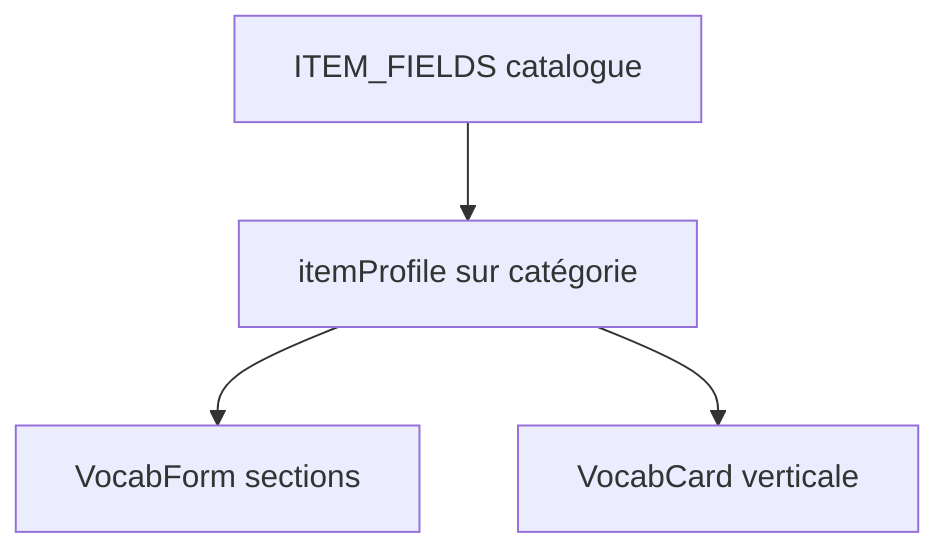

# Plan : Vocab profils flexibles + traductions optionnelles

**Date :** 2026-08-12  
**Complexité :** moyenne  
**Tags :** `data-modeling` `ux` `solid`

## Problème (une phrase)

Le schéma vocab force FR/EN/MG et un modèle type MediVocabs (tabs), alors qu’on veut des thèmes avec fiches verticales souples (synonymes, antonymes, contexte, etc. selon le thème).

## Ce que j'ai compris de l'existant (EXPLORE)

- SSOT : `vocabDomainSchema.js` (`ITEM_FIELDS`, validation, CSV)
- UI : `VocabCard` / `VocabForm` affichent toujours 3 langues ; tabs pilotent example/dialogue
- Thèmes = `organization.categories` ; pas de `itemProfile` aujourd’hui

## Options

### Option A — Champs optionnels partout, masquer le vide
- Pour : simple
- Contre : formulaire propose antonyme même pour phrasal verbs

### Option B — Catalogue + profil par catégorie + fiche verticale
- Pour : souple, mobile-friendly, compatible MediVocabs
- Contre : un peu plus de code

### Option C — JSON libre `extra: {}`
- Contre : plus de validation / CSV stable

## Recommandation

**Choix :** B  
**Pourquoi :** Open/Closed + SSOT ; UI empilée (pas scroll X)  
**Concept clé :** profil de champs par thème  
**Bonne pratique nommée :** single source of truth ; Open/Closed

## Diagramme

## VERIFY prévu

- [ ] Build OK
- [ ] Item avec seulement EN : pas de labels FR/MG
- [ ] Catégorie profil `adjective` : form + card montrent synonymes/antonymes
- [ ] MediVocabs : tabs / example / dialogue inchangés

## Statut

- [x] Validé par l'humain (« go implement »)
- [x] Build fait
- [x] Verify OK (build pass)
- [x] Log fait
- [ ] Migration Supabase `attrs` à appliquer sur le projet distant