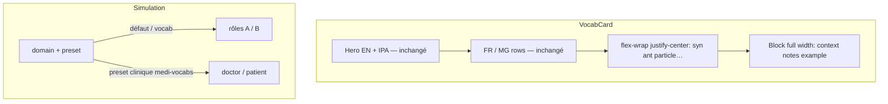

# Plan : Cartes / header / i18n display / rôles simulation

**Date :** 2026-08-12  
**Complexité :** moyenne  
**Tags :** `visibility` `ux` `data-modeling`

## Problème (une phrase)

Quatre écarts UX : un objet i18n fuit encore en `[object Object]` ; les colonnes courtes de la carte s’empilent en pleine largeur ; la barre entre titre et onglets de contenu est trop éclatée ; la simulation vocabulaire générique parle encore médecin/patient.

## Ce que j'ai compris de l'existant (EXPLORE)

- **i18n / `[object Object]`** : `coercePhoneticString` existe déjà (IPA, form, providers). Ça ne suffit pas : `LangRow` interpolé `item.fr`/`item.en` brut ; `normalizeI18nValue` fait `String(value.en)` — si `en` est encore un objet, React affiche `[object Object]`. Un IPA déjà persisté en texte `"[object Object]"` est masqué (chaîne vide) au lieu d’être récupéré.
- **Carte** : `VocabCard` — titre EN + IPA + FR/MG en lignes (à **ne pas** changer). Chaque champ structure (`synonyms`, `antonyms`, `context`…) est une `Section` pleine largeur empilée. Les syn/ant courts gaspillent la largeur ; l’exemple long en bas est OK en block.
- **Header** (`VocabsView`) : titre → modes Lecture/Révision/Image + Simulation → hint → search desktop → catégorie mobile → search mobile → **puis** `VocabTabBar` (type de contenu, **hors scope**). Desktop : catégories dans la sidebar, pas dans cette barre.
- **Simulation** : `getScenarioProfile(domainId)` → tout `medi-vocabs` = `MEDICAL_PROFILE` (doctor/patient) + prompts Groq/mocks/pad/quiz « clinique ». Les autres domaines = learner/partner, mais des fallbacks `doctor|patient` restent dans `ConversationPlayer`, `voices.js`, `vocabCoverage`, `groq.js`. L’utilisateur veut une simu **vocabulaire générique** (rôles A / B), pas un cabinet médical.

## Options

### 1 — `[object Object]`

**A — Coercition récursive unique `displayText` / `coerceI18nText` aux frontières + au render**  
- Pour : un helper, plus de `String(obj)` ; récupère `en`/`fr`/`mg` imbriqués ; refuse le littéral `"[object Object]"`.  
- Contre : un peu plus de code dans `vocabItemStructure.js`.

**B — Nettoyer seulement le render de `VocabCard`**  
- Pour : patch local.  
- Contre : le form, CSV, quiz, TTS peuvent encore afficher/parler l’objet.

**Choix :** A.

### 2 — Disposition des colonnes (pas les mots principaux)

**A — Flex wrap type Bootstrap, centré** (recommandé)  
Une rangée `flex flex-wrap justify-center` pour les champs **courts** (listes + textes non-traduits : syn, ant, particle, pattern, register, customs list/text courts). Chaque cellule = largeur intrinsèque (`w-auto`, `min-w-[8rem]`, `max-w-full`), contenu centré. Si ça dépasse, wrap. Champs **longs** (`context`, `notes`, `example`) restent pleine largeur en dessous.  
- Pour : exactement la demande ; KISS ; pas de grille 12 cols.  
- Contre : un custom « phrase longue » mal classé → filet longueur (~56 car.) le passe en block.

**B — CSS grid `auto-fit / minmax(140px, 1fr)`**  
- Pour : colonnes égales.  
- Contre : force une largeur min même pour un chip d’un mot ; moins « occupe seulement une petite partie ».

**C — Flag `layout` dans `itemStructure`**  
- Contre : YAGNI.

**Choix :** A. **On ne touche pas** au titre EN, IPA, ni aux lignes FR/MG.

### 3 — Header compact (entre titre et type de contenu)

**A — Une toolbar unique** (recommandé)  
Un bandeau : à gauche le segmented Lecture/Révision/Image (+ Simulation en icône/chip) ; au centre/droite search qui prend l’espace restant ; catégorie en contrôle compact (desktop : chip « Catégories » ouvrant le même arbre en popover **ou** on laisse la sidebar desktop et on compacte seulement modes+search sur une ligne). Mobile : `[modes][sim]` puis `[catégorie accordion]` + search collés, moins de gaps.  
Ne pas modifier `VocabTabBar`.

**B — Tout mettre dans un menu « ⋯ »**  
- Contre : cache Lecture/Révision, trop d’friction.

**Choix :** A, variante **sidebar desktop conservée** (déjà claire) + **une seule rangée modes + search** sur desktop ; mobile : modes+sim sur une ligne, catégorie+search collés en dessous. Hint de mode en `sr-only` ou une ligne plus discrète.

### 4 — Rôles simulation (plus de docteur/patient sur le vocab générique)

**A — Profil général = A / B partout ; médical seulement si preset clinique explicite sur `medi-vocabs`**  
- Vocabulaire « tout court » → rôles `a` / `b` (libellés Interlocuteur A / B).  
- `medi-vocabs` : défaut = profil général A/B ; profil médical (doctor/patient + presets clinique/pharmacie) **uniquement** si l’utilisateur choisit un preset médical.  
- Audit : prompts Groq, mocks, pad, quiz cloze, `simulationUiCopy`, `ConversationPlayer`, `voices.js`, `written-turn` allowed roles.

**B — Supprimer entièrement le profil médical**  
- Pour : zéro fuite.  
- Contre : on jette les presets clinique déjà faits pour MediVocabs.

**C — Garder médical pour tout `medi-vocabs`** (statut actuel)  
- Contre : c’est le bug rapporté.

**Choix :** A.

## Recommandation

**Choix :** 1A + 2A + 3A + 4A.  
**Pourquoi :** une coercition à la frontière (pas un cache-misère render) ; wrap des colonnes sans casser le lexique EN-first ; toolbar plus dense sans toucher aux onglets ; rôles A/B = contrat clair pour « simu vocabulaire », médical = opt-in preset.  
**Concept clé :** coerce at boundaries ; density by content role ; domain-aware scenario profile (default general).  
**Bonne pratique nommée :** coerce at boundaries ; single source of truth (profil de scénario) ; progressive disclosure of density.  
**Complexité :** moyenne.

## Diagramme (si utile)

## VERIFY prévu

- [ ] Carte : synonyme + antonyme côte à côte si ça tient ; wrap si étroit ; exemple toujours en bas pleine largeur ; EN/FR/MG inchangés.
- [ ] Plus aucun `[object Object]` visible (carte, form IPA, champs translate) ; IPA objet `{en:"/…/"}` affiche `/…/`.
- [ ] Header : une rangée modes+search desktop ; onglets type de contenu identiques.
- [ ] Simulation domaine non-médical (et medi-vocabs sans preset clinique) : bulles / prompts / mock = A et B, zéro « doctor/patient » dans le dialogue généré par défaut.

## Statut

- [x] Validé par l'humain
- [x] Build fait
- [x] Verify OK
- [x] Log fait (tags + pratique nommée)
