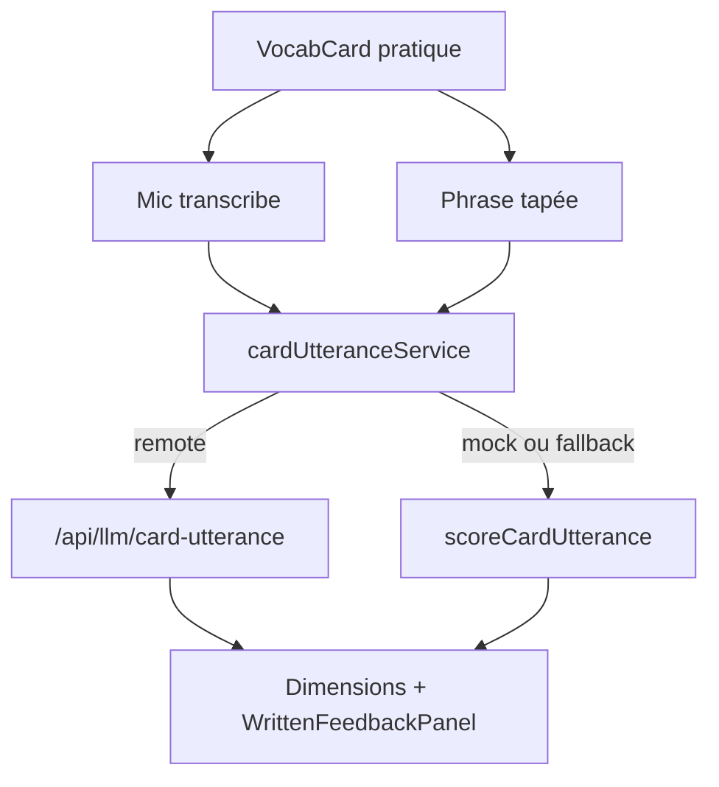

# Plan : Évaluation phrase sur carte vocab (pas répétition)

**Date :** 2026-08-13  
**Complexité :** moyenne  
**Tags :** `ux` `learning` `api-design`

## Problème (une phrase)

La pratique oral/texte sur la carte exige de répéter le mot/l’exemple ; l’apprenant doit pouvoir produire sa propre phrase avec le mot (ou synonyme/antonyme) et être jugé sur grammaire, naturel, niveau, et surtout le bon contexte.

## Ce que j'ai compris de l'existant (EXPLORE)

- `VocabCard` ouvre `PronunciationPractice` avec `targetText={titleEn}` → `scorePronunciation` compare token par token et **pénalise les mots en trop**.
- `DialogueLangLines` (exemples) reste un drill « répéter la réplique » — hors scope.
- Le coach écrit (`groqWritten` + `WrittenFeedbackPanel`) a déjà grammaire / naturalness / vocabulaire thème, mais c’est un **dialogue** (partnerTurn), pas une phrase de carte.
- Pattern ports & adapters : mock | remote LLM via `aiClient`.

## Options

### A — Réutiliser `written-turn` avec un fake dialogue
- Pour : zéro nouvel endpoint.
- Contre : `partnerTurn` / rôles A-B hors sujet ; le prompt pousse encore le recouvrement thème, pas le contexte du lemme.

### B — Endpoint dédié `card-utterance` + score local de repli (recommandé)
- Pour : contrat clair ; poids explicites (contexte dominant) ; mock/tests déterministes ; oral = transcribe puis même juge.
- Contre : un handler Groq de plus (comme quiz-feedback).

### C — Heuristique locale seulement
- Pour : pas de Groq.
- Contre : ne sait pas si « bank » est le bon sens.

## Recommandation

**Choix :** B.  
**Pourquoi :** le juge de répétition et le juge pédagogique n’ont pas la même responsabilité (SRP).  
**Concept clé :** produce-and-assess, pas repeat-and-overlap.  
**Bonne pratique nommée :** Single Responsibility ; ports & adapters ; fail safely (LLM down → score local).

## Diagramme

## VERIFY prévu

- [ ] Tests domain : phrase originale avec le mot = bon contexte ; mot isolé = contexte faible ; synonyme compte ; zéro mot cible = contexte bas
- [ ] `CI=true npm run build` + eslint max-warnings 0
- [ ] Push `master` — Vercel success

## Statut

- [x] Validé par l’humain (push master si fini)
- [x] Build fait
- [x] Verify OK
- [x] Log fait
