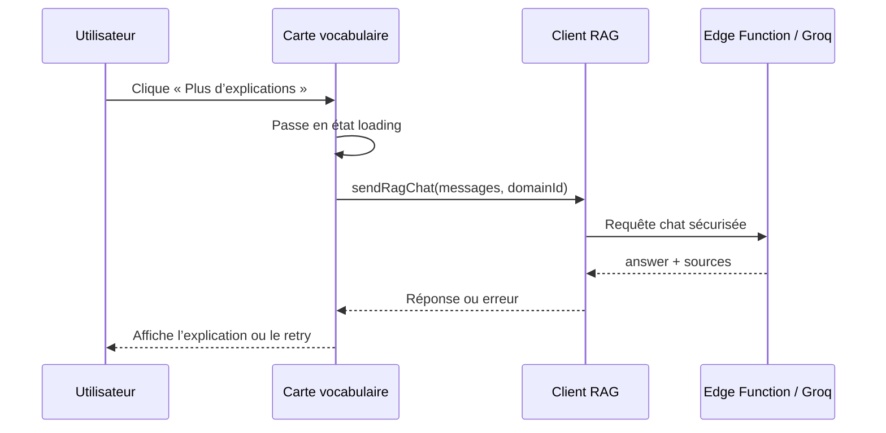

# Plan : partage mobile, suppression observable et explications vocabulaire

**Date :** 2026-08-20  
**Complexité :** moyenne  
**Tags :** `visibility` `state` `async`

## Problème (une phrase)

Le menu de partage mobile est difficilement cliquable, la suppression d’un domaine ne donne pas assez de feedback pendant son opération asynchrone, et les cartes de vocabulaire ne proposent pas d’explication contextuelle via l’intégration Groq existante.

## Ce que j'ai compris de l'existant (EXPLORE)

- Fichiers / zones touchées : `front/src/pages/VocabsView.jsx`, `front/src/components/CompactMenu.jsx`, `front/src/pages/VocabsGlobalAdmin.jsx`, `front/src/components/vocabs/VocabCard.jsx` et `front/src/lib/ragClient.js`.
- Patterns déjà utilisés : états React locaux pour les opérations asynchrones, `Loader2` pour le chargement, `sendRagChat()` pour appeler la fonction Supabase `chat`, et classes Tailwind pour la superposition et l’accessibilité visuelle.
- Contraintes : la clé Groq reste côté Edge Function ; l’appel RAG actuel ne supporte que `medi-vocabs` ; le stockage Supabase ne fournit pas de progression détaillée par fichier pour `deleteDomain()`.

## Options

### Option A — Corriger uniquement le z-index et afficher un simple spinner

- Pour : changement rapide et faible surface de code.
- Contre : ne traite pas le fallback presse-papiers mobile ni l’absence de statut explicite pendant le rafraîchissement.

### Option B — Renforcer le menu mobile, ajouter un fallback de copie et modéliser explicitement les états de suppression

- Pour : corrige le clic dans les contextes de superposition, rend la copie plus robuste et donne un feedback immédiat puis persistant pendant toute l’opération.
- Contre : nécessite quelques états UI supplémentaires et ne peut pas afficher un nombre réel de fichiers sans modifier le contrat du provider.

### Option C — Ajouter une nouvelle API backend de progression détaillée

- Pour : permettrait de compter les objets supprimés en temps réel.
- Contre : disproportionné pour le besoin actuel, plus risqué et incompatible avec le fait que la suppression Supabase est effectuée par opérations SQL groupées.

## Recommandation

**Choix :** Option B.  
**Pourquoi :** elle améliore directement l’expérience utilisateur sans changer le contrat de stockage ni exposer la clé Groq. Le bouton d’explication appellera le même client RAG que le chat, avec le mot, ses traductions et le contexte disponible dans la carte.  
**Concept clé :** rendre explicites les états asynchrones (`idle`, `loading`, `success`, `error`) au niveau de l’interface.  
**Bonne pratique nommée :** *single source of truth* pour le statut d’opération et *explicit loading/error states* pour les actions longues.  

## Diagramme (si utile)

## VERIFY prévu

- [ ] Compiler le frontend avec `npm run build`.
- [ ] Exécuter les tests existants avec `npm test -- --watchAll=false`.
- [ ] Vérifier manuellement le menu mobile, la suppression avec réseau lent et le bouton d’explication sur `medi-vocabs`.

## Statut

- [x] Validé par l'humain
- [ ] Build fait
- [ ] Verify OK
- [ ] Log fait (tags + pratique nommée)
